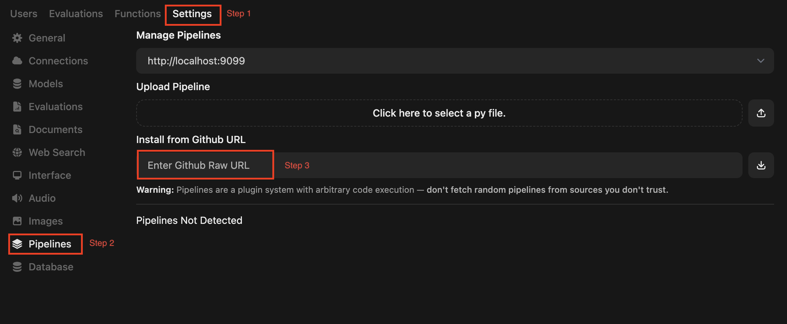

# Open WebUI Pipelines

## Purpose
The pipelines in this folder are intended to be used with the **Open WebUI Pipelines** framework.

## Installation Instructions
1. Follow the steps provided in the [Open WebUI Pipelines documentation](https://docs.openwebui.com/pipelines/) to enable Pipelines with Open WebUI.
2. Install these pipelines by copying and pasting the GitHub URLs of the corresponding `.py` files into the **Admin → Settings → Pipelines panel** in Open WebUI.

## Import Example Image

